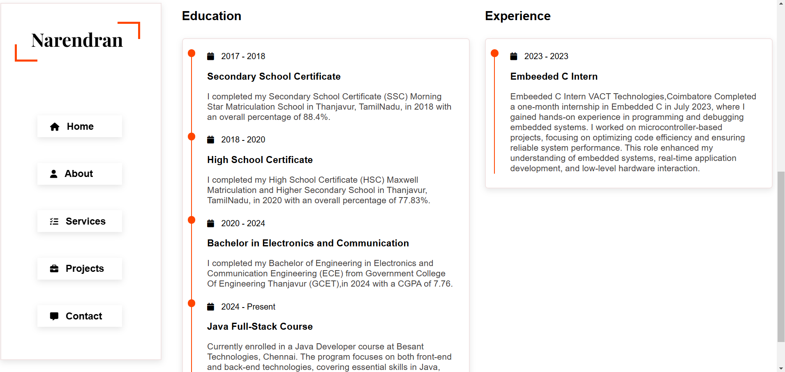
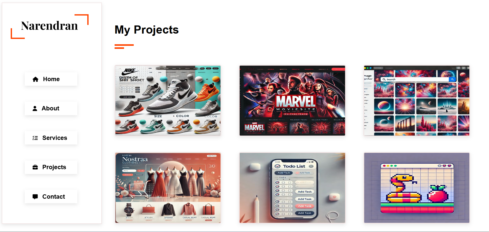

# Personal Portfolio

Welcome to my personal portfolio repository! This project showcases my skills, projects, and professional experience as a frontend developer. It has been designed to be fully responsive without using Bootstrap, focusing on clean, modern designs and intuitive navigation.

## Features

- *Responsive Design*: Works seamlessly on devices of all screen sizes.
- *Dynamic Navigation*: Each page has its own JavaScript file for specific functionality and an active link highlighting feature.
- *Dedicated Sections*:
  - *Home*: Brief introduction and call-to-action.
  - *About Me*: Overview of my background and skills (excluding Electronics Engineering details).
  - *Services*: Describes the services I offer as a developer.
  - *Projects*: Detailed showcase of my key projects.
  - *Contact*: Contact form for reaching out and a "Hire Me" popup that closes when clicking outside.
- *Custom Styling*: No scrollbar visible for a clean user experience.

## Pages Overview

### 1. Home
Contains an introduction and links to the portfolio sections.

### 2. About
Highlights my educational background, skills, and professional journey.

### 3. Services
Describes my services, including:
- Frontend development
- Website responsiveness
- Project building

### 4. Projects
Showcases key projects such as:
- *TrueSteps*: A dynamic website for Nike sneakers that allows users to explore products, customize colors and sizes, and fill out a payment form (without payment integration).
- *MovieSite*: A frontend site listing Marvel movie details and upcoming releases.
- *Image Searcher*: A search tool using the Unsplash API to fetch and display images based on user queries.
- *Nostraa Clothing*: A clothing catalog website that displays product details like prices and images and links to social media.
- *ToDo List*: A simple application to add, edit, and delete tasks.
- *Snake Game*: An interactive JavaScript-based game.

### 5. Contact
Contains a contact form and a "Hire Me" button.

## Technology Stack

- *HTML*
- *CSS*
- *JavaScript*

## How to Use

1. Clone this repository:
   ```bash
   git clone https://github.com/Narendran1424/Portfolio.git
2. Navigate to the project directory:

cd Portfolio


3. Open index.html in your browser to view the portfolio.

## Pages Overview with Screenshots

### 1. Home Page


### 2. About Page



### 3. Services Page


### 4. Projects Page


### 5. Contact Page


## License

This project is licensed under the terms of the [MIT License](LICENSE).
